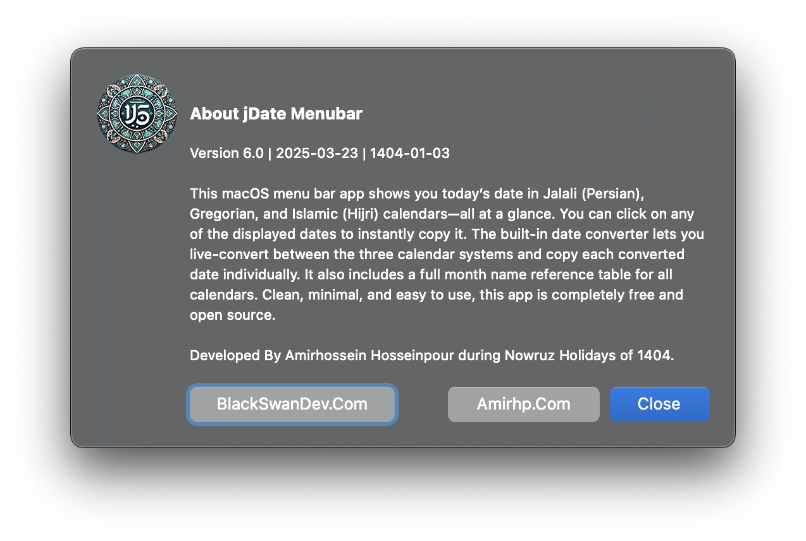

# [Jalali Date Toolbar for macOS](https://github.com/blackswandevcom/jalaliDate-macOS)
Developed by **[AmirhpCom](https://amirhp.com/)** at [BlackSwanDev.Com](https://blackSwanDev.com)

### 📅 Introduction
The Jalali Date App is a lightweight macOS menu bar application that displays the current date in the Jalali (Persian) calendar alongside the Gregorian date. Designed to be simple and non-intrusive, it’s the perfect companion for users who need quick access to both Persian and Western calendars directly from their Mac’s menu bar.

### 🎉 Version 2.0
In this release, we’ve made some great enhancements to improve usability and accessibility:

-	**Refreshed Menubar Display**: We’ve tweaked the menubar display to be even more clear and user-friendly, providing you with the information you need at a glance.
-	**Quick Peek at Month Names**: Added a convenient “Months Table” option, allowing you to view the Gregorian and Jalali month names side-by-side. It’s perfect for quick reference – especially if you’re like us and occasionally need a reminder! 😉

### 🚀 Key Features
+ Displays the current Jalali (Persian) date and Gregorian date in the macOS menu bar.
+ Automatic light/dark mode adaptation to match macOS appearance settings.
+ Minimalist design with Persian typography for an authentic touch.
+ Quick copy: Copy either the Jalali or Gregorian date to your clipboard with a single click.

### 🔑 Installation Guide
1.	Download the .dmg File: Download the latest release from the Releases section.
1.	Open the .dmg: Double-click the downloaded .dmg file to mount it.
1.	Drag to Applications: Drag the Jalali Date App icon into your Applications folder.
1.	Run the App: Open the app from your Applications folder. You may need to grant permission to run it as it’s from an unidentified developer.

## 📥 Installation Instructions
1. **Download the `.dmg` File**: Get the latest version of the Jalali Date App `.dmg` file from the [Releases](https://github.com/blackswandevcom/jalaliDate-macOS/releases) section.
2. **Open the `.dmg`**: Double-click the downloaded `.dmg` file to mount it.
3. **Drag to Applications**: In the window that opens, drag the **JalaliDateApp** icon into the **Applications** folder shortcut.
4. **Eject the `.dmg`**: Once the app is installed, you can eject the `.dmg` by right-clicking it on your desktop or in the Finder sidebar and selecting **Eject**.
5. Your Jalali Date App is now installed and ready to use!

### 🛠 How to Use
1.	Launch the App: After installation, run the app from the Applications folder or open it directly.
2.	Menu Bar Display: The current Jalali date will be displayed in the menu bar. Click on the icon to access additional options.
3.	Copy Dates: From the menu, click on any date (Jalali or Gregorian) to copy it directly to your clipboard.
4.	About and Support: Click on the “About” option in the menu for more information on the app and the developer.

### 💻 Compatible Devices
- Operating System: macOS 10.15 (Catalina) or later
- Hardware: Compatible with Intel and Apple Silicon (M1/M2) Macs
- Appearance: Supports macOS light and dark modes

### ⚠️ Disclaimer
This app is provided as-is without any guarantees or warranties. Please verify all date data accuracy if used for critical purposes. The developer does not assume responsibility for any inaccuracies or errors that may occur in the displayed Jalali or Gregorian dates.

### 📜 Copyleft
This project is open-source and licensed under the GNU General Public License v3.0. You are free to use, modify, and distribute this software, provided that any copies or derivative works are also licensed under the same GPL terms.

### 👤 About the Developer
This app is developed by **[Amirhp.Com](https://amirhp.com/)**, a software developer passionate about creating tools for the Persian-speaking community. If you have any suggestions or encounter issues, feel free to reach out via GitHub Issues.

### ✨ Contributions
> Contributions are welcome! If you’d like to contribute, please fork the repository and create a pull request. You can also open an issue for any suggestions or bug reports.

### 🌐 Additional Resources
-	[Jalali Calendar (Persian Calendar) Wikipedia](https://en.wikipedia.org/wiki/Jalali_calendar)
-	[macOS Development Documentation](https://developer.apple.com/documentation/)

### 📸 Screenshots

|Dropdown Menu|Copied Alert|About Dialog|
|---|---|---|
||||
